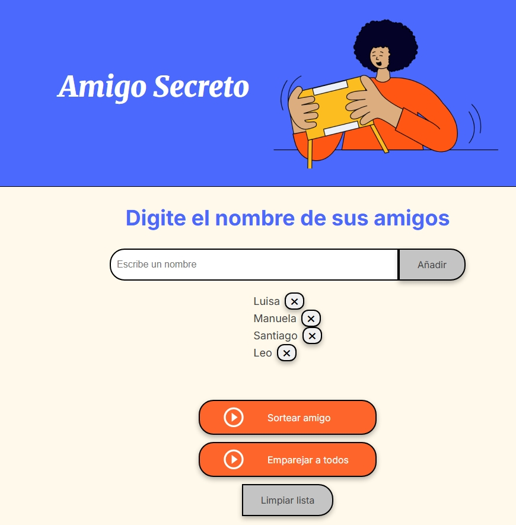
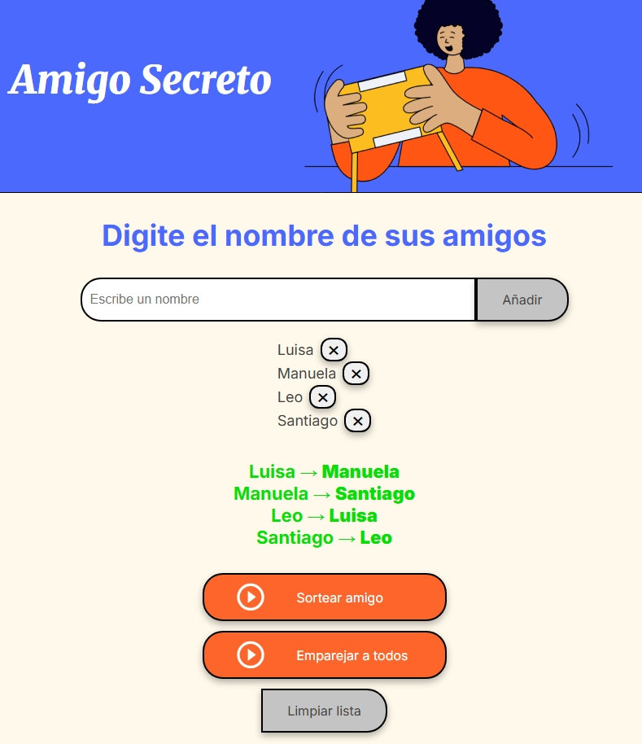

# 🎁 Amigo Secreto

Proyecto del challenge **Principiante en Programación (Alura Latam + Oracle)**.  
El objetivo es practicar lógica de programación con **JavaScript**, aplicando arrays, funciones, condicionales y manipulación del DOM.  
El HTML y CSS fueron provistos por el curso, y la lógica en JavaScript se desarrolla aquí.

---

## ✨ Funcionalidades

- Agregar nombres a una lista.
- Validación: evita vacíos y duplicados.
- Sorteo simple: elige un participante al azar.
- Eliminar un nombre específico (❌).
- Limpiar la lista completa.
- Sorteo avanzado: emparejar a todos sin auto-asignación.
- Agregar con tecla **Enter**.

---

## 🚀 Demo en vivo

👉 [Ver en GitHub Pages](https://sgm0623.github.io/amigo-secreto/)

---

## 🖼️ Capturas

### Agregar nombres

### Sorteo simple

### Emparejar a todos

---

## 📂 Estructura del proyecto

